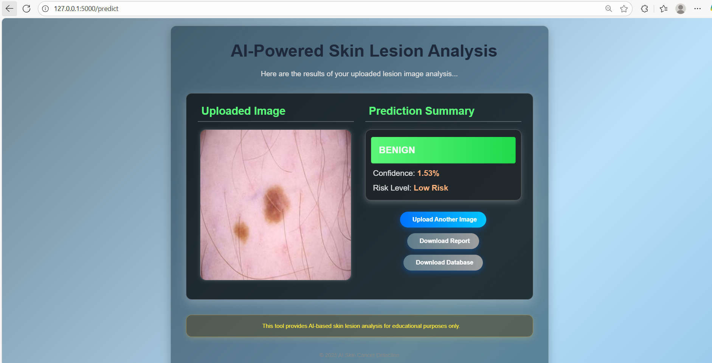

# AI-Powered Skin Lesion Analysis  

## Overview  
This project implements a deep learning-based solution to classify skin lesions as **Benign** or **Malignant** using dermatoscopic images. By leveraging a trained Sequential model, the system provides early risk categorization, helping medical professionals and patients in preliminary melanoma detection. The solution is deployed as a Flask-based web application with an intuitive interface.  

## Objectives  
- Build a deep learning model to classify lesions into benign or malignant categories.  
- Provide an AI-assisted decision support tool with confidence scores and risk levels.  
- Develop a user-friendly web interface for image upload, analysis, and reporting.  
- Enable database storage and report downloads for clinical tracking.  

## Dataset  
The project uses a **Melanoma Skin Cancer Dataset** containing dermatoscopic images. The dataset consists of two primary classes:  
- **Benign** lesions  
- **Malignant** lesions  

The images were preprocessed and used for training the Sequential Keras model to achieve reliable classification performance.  

## Tech Stack  
- **Languages and Libraries**: Python, NumPy, Pandas, Matplotlib  
- **Deep Learning Framework**: TensorFlow / Keras (Sequential Model)  
- **Frameworks**: Flask, Jinja2  
- **Frontend**: HTML, CSS (Glassmorphism design)  
- **Utilities**: reportlab (for PDF reports), pickle/joblib (for model persistence)  

## Key Features  
- Upload dermatoscopic lesion images with patient details.  
- Classifies skin lesions as **Benign** or **Malignant**.  
- Displays **confidence score (%)** with **risk categorization (Low / High)**.  
- Downloadable **PDF analysis report**.  
- Maintains a **database of analyzed cases**.  
- Glassmorphism-inspired modern user interface.  

## Screenshots  

### Upload Page  
  

### Prediction Result  
  

### Generated Report  
  

## Setup Instructions  
1. Clone the repository:  
   ```bash
   git clone https://github.com/22ad085/AI-Powered-Skin-Lesion-Analysis.git
   ```
2. Navigate to the project directory:
    ```bash
    cd AI-Powered-Skin-Lesion-Analysis-
    ```
3. Install the required dependencies:
    ```bash
    pip install -r requirements.txt
    ```
4. Run the Flask application:
    ```bash
    python app.py
    ```
## Model Training and Evaluation
- Images were preprocessed and augmented for robustness.  
- A **Sequential Keras Model** was trained for binary classification.  
- The dataset was split into training and validation sets to monitor accuracy and loss.  
- The model outputs both **class prediction** and **confidence score**.  
- Evaluation metrics (accuracy, precision, recall) were used to assess performance.  

## Web Interface
The web application provides an intuitive interface:  
- `index.html`: Upload page for image and patient details  
- `result.html`: Displays prediction, confidence, and risk level  
- Reports are automatically generated and downloadable in PDF format  

## Expected Outcomes
- A deep learning model capable of classifying lesions with confidence scores.  
- Risk stratification into **Low** or **High** categories.  
- A web-based tool for real-time analysis and reporting.  
- Useful reference for integrating AI into dermatological diagnostics.  

## Contributors
- Karthika Lakshmi (Ramco Institute of Technology)  

## License
This project is licensed under the MIT License - see the [LICENSE](LICENSE) file for details.
